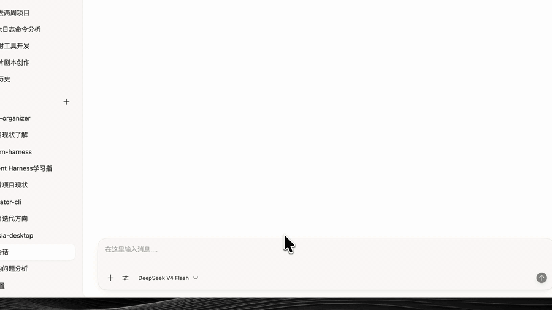
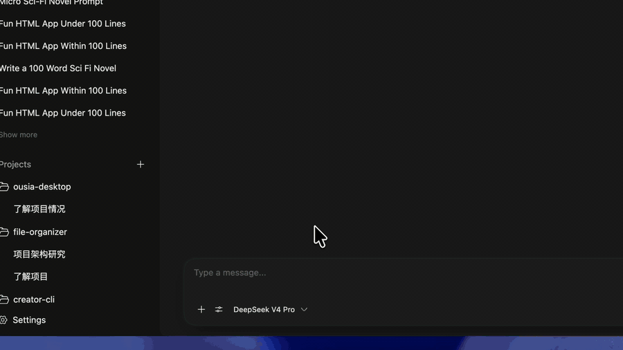

<p align="center"><sub><strong>MAC CLIENT FOR PI</strong></sub></p>

<h1 align="center">Ousia</h1>

<p align="center">
  <strong>Super light. Clean by design.</strong><br>
  A faster, smoother way to work with Pi.
</p>

<p align="center">
  <code>≈10 MB DMG</code>&nbsp;&nbsp;·&nbsp;&nbsp;<code>DIRECT PI RPC</code>&nbsp;&nbsp;·&nbsp;&nbsp;<code>SIGNED &amp; NOTARIZED</code>
</p>

<p align="center">
  <a href="https://github.com/s1dashu/ousia/releases/latest"><strong>Download for macOS</strong></a>
  ·
  <a href="#requirements">Requirements</a>
  ·
  <a href="#development">Development</a>
</p>

## See Ousia in action

### Light mode

<p align="center">
  
</p>

### Dark mode

<p align="center">
  
</p>

## Pi, with a better desktop experience

Ousia gives Pi a focused, polished workspace on macOS. It connects directly to the Pi runtime on your Mac, so your existing configuration, credentials, models, extensions, and sessions remain the source of truth.

The downloadable DMG is only **about 10 MB** because Ousia does not bundle Node.js or a second agent runtime.

## Why Ousia

- **Super lightweight** — an approximately 10 MB DMG with no bundled Node.js or Pi runtime.
- **Cleaner, more polished UI/UX** — a calm Mac-first interface with projects, sessions, themes, streaming tool previews, and a composer that stays focused on the work.
- **Faster, smoother performance** — a lean native host, direct Pi RPC, bounded streaming updates, and responsive conversation rendering.
- **Improved stability and reliability** — strict protocol validation, atomic state persistence, single-instance protection, and structured runtime logs.

## Download

The current release supports **macOS on Apple Silicon**.

1. Download the latest DMG from [GitHub Releases](https://github.com/s1dashu/ousia/releases/latest).
2. Open the DMG and move the app to `Applications`.
3. Launch it and select your existing Pi executable, or let the app install Pi into its own managed directory.

Release builds are signed with a Developer ID certificate, notarized by Apple, and validated with Gatekeeper before publishing.

## What you can do

- Organize conversations into projects and sessions.
- Stream assistant responses, thinking, tool calls, and file previews in real time.
- Queue follow-up messages while Pi is working, or switch to steering mode.
- Choose from the models and providers already configured in Pi.
- Interrupt, compact, branch, move, archive, and export sessions.
- Tune theme, content width, type size, line spacing, and message density.
- Reuse the same Pi credentials, extensions, settings, and session directory across the CLI and desktop app.

## How it stays light

```text
┌──────────────────────────┐        JSONL RPC        ┌──────────────────────┐
│          Ousia           │  ───────────────────▶   │   pi --mode rpc      │
│  interface + native host │                         │   your Pi runtime     │
└──────────────────────────┘                         └──────────────────────┘
                                                               │
                                                               ▼
                                                  config · models · sessions
```

Ousia owns the desktop experience. Pi owns the agent runtime. There is no duplicate credential store and no bundled runtime hidden inside the application package.

## Requirements

To connect an existing Pi installation, Ousia only needs a valid `pi` executable. It can discover Pi from your login-shell `PATH`, common install locations, the active npm global prefix, or a path selected in Settings.

If Pi is not installed, Ousia can use your existing Node.js and npm to install `@earendil-works/pi-coding-agent` into an app-owned directory. This optional setup does not change the system npm prefix and never removes `~/.pi`.

## Development

Prerequisites:

- macOS
- Node.js and npm
- Rust toolchain
- Pi, or a path supplied through `PI_GUI_PI_PATH`

Start the development app:

```sh
npm ci
npm run desktop:dev
```

Use a specific Pi executable when needed:

```sh
PI_GUI_PI_PATH=/absolute/path/to/pi npm run desktop:dev
```

Run the required checks:

```sh
npm run typecheck
npm run lint
cargo test --manifest-path src-tauri/Cargo.toml
npm run build
```

Build the macOS app locally:

```sh
npm run desktop:build -- --bundles app
```

The application is written with React, TypeScript, Tauri, and Rust. The desktop host communicates with Pi through strict line-delimited JSON over standard input and output.

<details>
<summary><strong>Signed macOS release builds</strong></summary>

Official releases require a Developer ID identity and Apple notarization credentials:

```sh
export APPLE_SIGNING_IDENTITY="Developer ID Application: Your Name (TEAMID)"
export APPLE_ID="you@example.com"
export APPLE_PASSWORD="app-specific-password"
export APPLE_TEAM_ID="TEAMID"
npm run release:mac
```

The release script fails immediately if signing, notarization, stapling, DMG verification, or Gatekeeper assessment does not succeed. It produces the DMG, a ZIP containing the same notarized app, and a SHA-256 checksum file.

</details>

## Data and diagnostics

- Pi remains the owner of its configuration, credentials, models, extensions, and sessions.
- Ousia stores only desktop UI state and the mapping required to reopen Pi sessions.
- State is written atomically.
- Host, subprocess, RPC, and renderer failures are recorded in structured local logs.
- Message content and tool payloads are not written to performance logs.

## License

See [LICENSE](./LICENSE) for the project license and [NOTICE](./NOTICE) for third-party notices.
