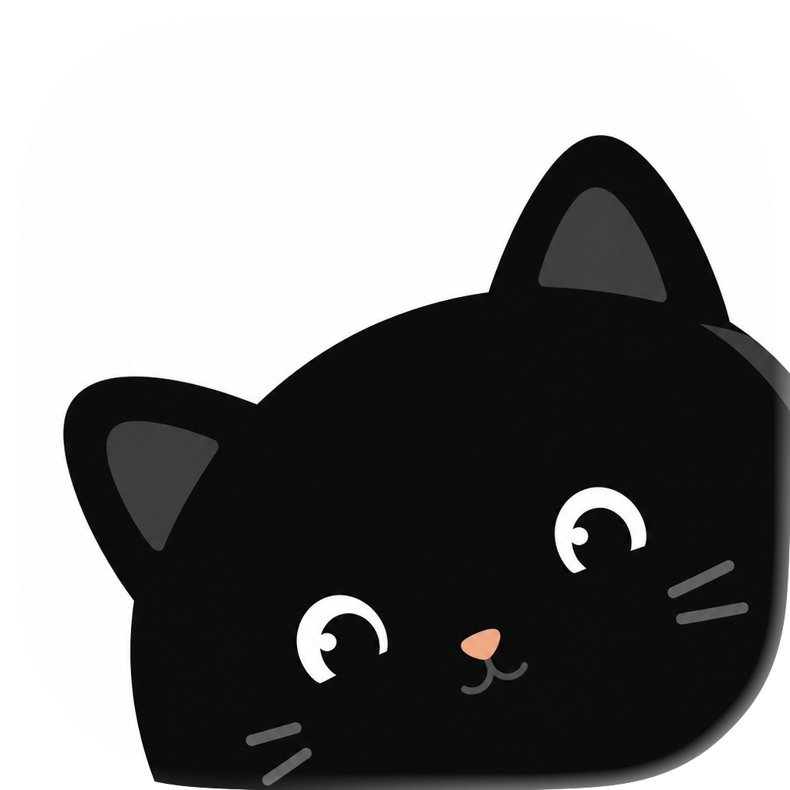
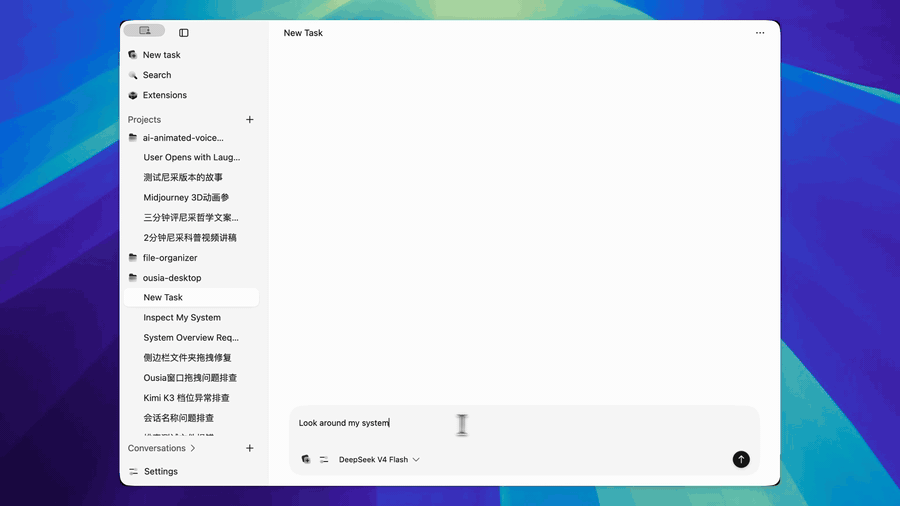

<p align="center">
  <picture>
    <source media="(prefers-color-scheme: dark)" srcset="./docs/media/ousia-logo.png">
    
  </picture>
</p>

<h1 align="center">Ousia</h1>

<p align="center">
  <strong>A minimalist desktop for the Pi Coding Agent.</strong>
</p>

<p align="center">
  <a href="https://github.com/s1dashu/ousia/releases/latest"></a>
  
  <a href="LICENSE"></a>
  
  
</p>

<p align="center">
  <a href="#-quick-start">Run from source</a>
  &nbsp;·&nbsp;
  <a href="#-development">Development</a>
</p>

<p align="center">
  <a href="https://github.com/s1dashu/ousia/releases/download/v0.1.32/Ousia-0.1.32-arm64.dmg">
    
  </a>
</p>

<p align="center">
  <a href="https://github.com/s1dashu/ousia/releases/download/v0.2.6/Pi_aarch64.dmg">Tauri Version</a>
</p>

---

## Recent changes

Latest published Pi Tauri releases:

- [**v0.2.6**](https://github.com/s1dashu/ousia/releases/tag/v0.2.6) — Clearer Pi request failures with durable history recovery, smoother sidebar drag-and-drop, consistent sidebar text alignment, and cleaner separation between daily builds and signed updater artifacts.
- [**v0.2.5**](https://github.com/s1dashu/ousia/releases/tag/v0.2.5) — Stable sidebar spacing across display and scrollbar configurations.
- [**v0.2.4**](https://github.com/s1dashu/ousia/releases/tag/v0.2.4) — Signed in-app updates with explicit download, install, and relaunch controls.

[View all releases →](https://github.com/s1dashu/ousia/releases)

## See Ousia in action

<p align="center">
  
</p>

## What is Ousia

**Ousia** is a minimalist macOS desktop client for the
[Pi Coding Agent](https://github.com/earendil-works/pi). It wraps Pi in a clean
app with project-aware sessions, streaming Markdown, and persistent chat history
— so you can keep the conversation going without leaving your codebase.

Think of it as a focused GUI for Pi. No tabs, no workspace extensions, no hidden
panels. Just your projects and Pi, side by side.

## Why Ousia

Pi is powerful in the terminal, but bouncing between your editor, terminal, and
its output creates constant friction. Ousia gives Pi a dedicated desktop surface
so conversations stay in context, tool invocation is visible inline, and
everything persists across restarts.

Ousia works with the Pi setup already on your Mac, so your providers, models,
credentials, resources, and session history stay in the same Pi ecosystem.

### In practice

- **Project-first sessions** — Every chat session is bound to a project
  directory. The agent reads, writes, and runs tools inside your project. Switch
  projects and the agent context follows.
- **Persistent everything** — Sessions, sidebar layout, window position, color
  theme, font preferences — all restored on relaunch.
- **Streaming Markdown** — Assistant responses render live with
  [Streamdown](https://streamdown.ai), including fenced code blocks, tables,
  and expandable tool-call summaries. Watch the agent think in real time.
- **Attachments in composer** — Drag files and images directly into a message
  when your model supports multimodal input.
- **Pi session controls** — Interrupt or compact a conversation, branch from an
  earlier message, move sessions between projects, and archive them without
  losing history.
- **Queue or steer** — Choose whether a new message waits as a follow-up or
  intervenes in the task Pi is currently running.
- **Model flexibility** — Configure Pi-compatible providers (Anthropic,
  OpenAI, Gemini, etc.), then choose the model and thinking level for each
  session.
- **Shared Pi config** — Ousia reads credentials and model config from your
  local Pi agent directory (`~/.pi/agent`). Providers set up in the Pi CLI or
  TUI work in Ousia automatically — and vice versa.
- **Local desktop state** — Ousia keeps its project/session index and debug
  logs locally under its isolated application data and `~/.ousia/logs/`.

## 🚀 Quick start

### Download (macOS)

[Download the latest `.dmg`](https://github.com/s1dashu/ousia/releases/download/v0.1.32/Ousia-0.1.32-arm64.dmg),
open it, drag **Ousia** into **Applications**, and launch. Previous versions and
release notes remain available on the [Releases page](https://github.com/s1dashu/ousia/releases/latest).

> ⚠️ Ousia is pre-release software. You'll hit rough edges. We ship fast and
> iterate faster.

### Run from source

```bash
# Requirements: Node.js ≥ 24, npm ≥ 11
git clone https://github.com/s1dashu/ousia.git
cd ousia
git checkout codex/archive-ousia-electron-v0.1.32
npm install
npm start
```

Active Electron development currently lives on the
[`codex/archive-ousia-electron-v0.1.32`](https://github.com/s1dashu/ousia/tree/codex/archive-ousia-electron-v0.1.32)
branch. The branch name is historical; it is the maintained Electron source.

On first launch, Ousia asks for a default workspace folder (defaults to
`~/Documents/Ousia`). Configure your Pi providers and default model in
**Settings**, then start a session.

## 🧱 Architecture

| Layer    | Stack                                                                 |
| -------- | --------------------------------------------------------------------- |
| Shell    | Electron 42 + Electron Forge + Vite                                   |
| UI       | React 19 + Tailwind CSS 4 + shadcn/ui + Framer Motion                 |
| Markdown | Streamdown (streaming + static modes)                                 |
| Agent    | Pi Coding Agent, hosted in Electron main process                      |
| Icons    | HugeIcons Core Free                                                   |
| State    | Local JSON via `Electron.app.getPath('userData')`                     |

The renderer talks to Pi through a narrow `window.ousia` IPC bridge. Electron
main resolves every session's canonical project before routing the request, so
renderer paths cannot expand Pi's workspace.

```
┌─────────────────────────────────────┐
│  Renderer Process                   │
│  ┌──────────┐  ┌──────────────────┐ │
│  │ Sidebar  │  │     Chat         │ │
│  │ Projects │  │  ┌────────────┐  │ │
│  │ Sessions │  │  │ Streamdown │  │ │
│  │ Settings │  │  │ Tool calls │  │ │
│  └──────────┘  │  │ Composer   │  │ │
│                 │  └────────────┘  │ │
│                 └──────────────────┘ │
└──────────┬──────────────────────────┘
           │ window.ousia (IPC)
┌──────────▼──────────────────────────┐
│  Electron Main Process              │
│  ┌──────────────────────────────┐   │
│  │  Pi Agent Sessions           │   │
│  │  (canonical session +        │   │
│  │   project cwd routing)       │   │
│  └──────────────────────────────┘   │
│  ┌──────────────────────────────┐   │
│  │  App State Store (JSON)      │   │
│  └──────────────────────────────┘   │
└─────────────────────────────────────┘
```

## 🛠 Development

The commands below run from the active Electron branch linked above.

```bash
npm run typecheck    # Type-check all TypeScript targets
npm run lint         # ESLint across the project
npm run check        # Both of the above

npm run package      # Production app bundle → out/
npm run make         # Local unsigned DMG (fast iteration)
```

### Release build (macOS signed + notarized)

```bash
# Apple Developer credentials
export APPLE_SIGN_IDENTITY="Developer ID Application: Your Name (TEAMID)"
export APPLE_ID="you@example.com"
export APPLE_APP_SPECIFIC_PASSWORD="app-specific-password"
export APPLE_TEAM_ID="TEAMID"

npm run make:dmg:notarized   # Signed DMG + notarization
```

## Data and diagnostics

- Pi remains the source of truth for its providers, credentials, models,
  resources, and session history.
- Ousia writes desktop state atomically and keeps project/session restoration
  observable.
- Host, IPC, persistence, and renderer failures are recorded in structured
  local logs.
- Prompts, responses, tool payloads, credentials, and private file contents are
  excluded from diagnostic logs.

## 📖 Docs

| File | Covers |
| --- | --- |
| [`AGENTS.md`](./AGENTS.md) | Repository product direction and branch responsibilities |
| [`docs/product-context.md`](https://github.com/s1dashu/ousia/blob/codex/archive-ousia-electron-v0.1.32/docs/product-context.md) | Scope, product boundaries, glossary |
| [`docs/design.md`](https://github.com/s1dashu/ousia/blob/codex/archive-ousia-electron-v0.1.32/docs/design.md) | Design system, token ownership, and UI rules |
| [`docs/technical-architecture.md`](https://github.com/s1dashu/ousia/blob/codex/archive-ousia-electron-v0.1.32/docs/technical-architecture.md) | Stack, IPC model, state schema, logging |
| [`docs/streamdown.md`](https://github.com/s1dashu/ousia/blob/codex/archive-ousia-electron-v0.1.32/docs/streamdown.md) | Markdown rendering config and link handling |
| [`docs/shadcn-reference.md`](https://github.com/s1dashu/ousia/blob/codex/archive-ousia-electron-v0.1.32/docs/shadcn-reference.md) | Local shadcn/ui reference workflow |
| [`docs/development-state.md`](https://github.com/s1dashu/ousia/blob/codex/archive-ousia-electron-v0.1.32/docs/development-state.md) | Current implementation state and commands |

## 🤝 Contributing

Contributions are welcome. Before opening a PR:

1. Read the Electron
   [`CONTRIBUTING.md`](https://github.com/s1dashu/ousia/blob/codex/archive-ousia-electron-v0.1.32/CONTRIBUTING.md)
   and this branch's [`AGENTS.md`](./AGENTS.md)
2. Run `npm run check` to verify types and linting
3. For packaging changes, also run `npm run package`
4. Keep changes aligned with the current product direction (no extensions,
   no workspace panels)

## 📄 License

Ousia is [MIT](./LICENSE) © 2026 Ousia Desktop contributors.

Bundled CJK fonts are under [SIL OFL 1.1](./NOTICE).

---

<p align="center">
  <sub>Built with Electron, React, and Pi. Styled with Tailwind CSS & shadcn/ui.</sub>
</p>
